Godot Engine - Terrain Module v1.1.2 Documentation
===============================

**Table of content**
- [Godot Engine - Terrain Module v1.1.2 Documentation](#godot-engine---terrain-module-v112-documentation)
	- [Overview](#overview)
		- [How to install](#how-to-install)
	- [VERSION CHANGELOG](#version-changelog)
			- [IMPORTANT](#important)
	- [Getting Started](#getting-started)
		- [Creating a Terrain](#creating-a-terrain)
	- [The Terrain Inspector](#the-terrain-inspector)
		- [Properties](#properties)
	- [The TerrainData](#the-terraindata)
		- [Overview](#overview-1)
		- [Inspector Properties](#inspector-properties)
			- [Settings](#settings)
			- [Patches](#patches)
				- [Why this many textures?](#why-this-many-textures)
			- [Paint Textures](#paint-textures)
			- [Biomes](#biomes)
				- [BiomeItems](#biomeitems)
	- [Main Renderers](#main-renderers)
		- [TerrainRenderer](#terrainrenderer)
			- [CDLODRenderer](#cdlodrenderer)
				- [Properties](#properties-1)
				- [Common States Properties](#common-states-properties)
				- [State Dependant Properties](#state-dependant-properties)
		- [BiomeRenderer](#biomerenderer)
			- [Gridenderer](#gridenderer)
				- [Properties](#properties-2)
	- [The Terrain Editor](#the-terrain-editor)
		- [Overview](#overview-2)
		- [Starting with the TerrainMenu](#starting-with-the-terrainmenu)
			- [How to import External Textures](#how-to-import-external-textures)
		- [A lot of Tools](#a-lot-of-tools)
		- [Dedicated Editors](#dedicated-editors)
			- [Brush Editor](#brush-editor)
				- [Brush Properties](#brush-properties)
			- [Paint Textures Editor](#paint-textures-editor)
				- [Editor Properties](#editor-properties)
			- [Biome Manager](#biome-manager)
			- [Erosion \& Filters Editor](#erosion--filters-editor)
			- [Path Painter](#path-painter)
				- [Properties](#properties-3)
	- [TerrainPath](#terrainpath)
		- [The Node](#the-node)
		- [The TerrainPath Editor and Gizmos](#the-terrainpath-editor-and-gizmos)
			- [Editor Menu](#editor-menu)

Overview
----------

This module allows to create heightmap-based terrains inside Godot Engine or to import externally generated textures from thirdparty specialized softwares.	

It is entirely built on top of the `VisualServer` and the `PhysicsServer` API and it works almost the same on all platforms supported by Godot's `GLES3` and `GLES2` renderer. Be aware of platforms with no support for `non_power_of_2` texture sizes but prefer using heightmap with odd number of pixels when ever possible.

It is written as a core module in order to gain access to internal godot classes and tools not exposed to the user.

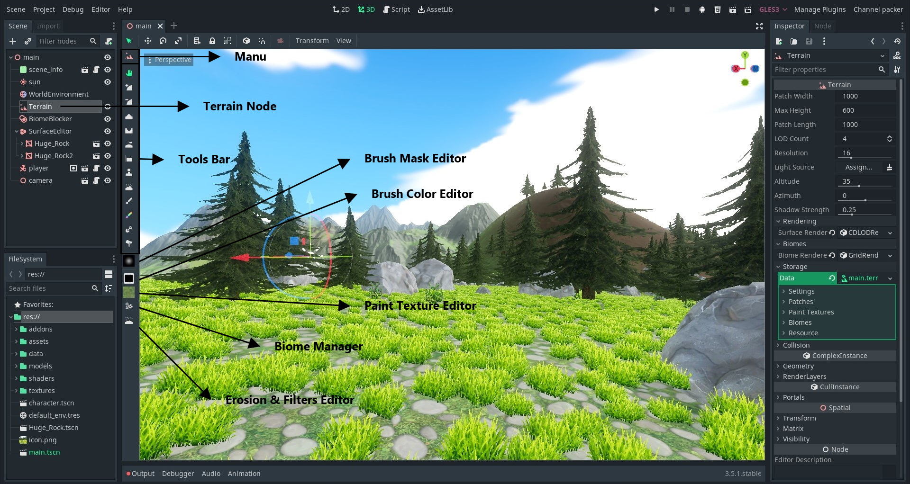

### How to install

Get the source code for Godot 3.5 or later. It is best to use latest stable 3.x version (Godot 4 is not supported yet). Decompress the terrain source code into the `modules` directory. A new folder named `terrain` should have been created **(the folder name must match the module name)**
```
[godot source code root folder]/modules/terrain
```
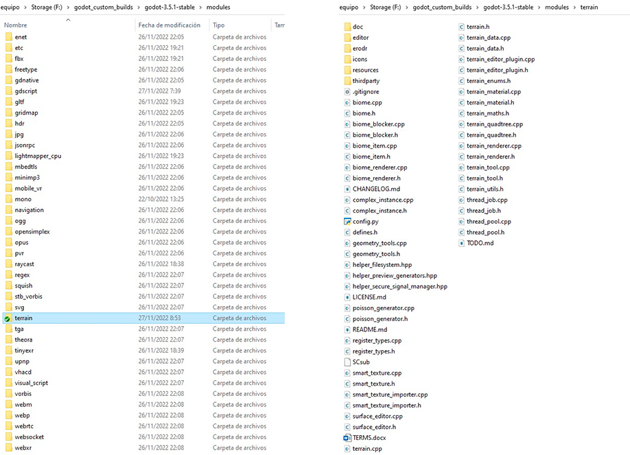

Once everything is ready, proceed to build the engine as stated in the godot documentation. Building Godot from source is pretty straight forward, just make sure to follow the guide step by step.	

VERSION CHANGELOG
--------------
1. REGRESSION: TerrainEditor - Paint Color Tool not working
2. OPTIMIZATION: BrushEditor - Removed unused `BRUSH_PROPERTY_COLOR` and unexposed brush color property
3. OPTIMIZATION: TerrainTool - Removed `set/get_brush_color` and added `Color` as a parameter to the private `_paint_color` method  
4. ENHANCEMENT: TerrainEditor - editor brush will change its color to the selected paint color when painting the Colormap  
5. ISSUE: BiomeItem - fix item not emitting signal on max_draw_distance property changed  
6. ISSUE: BiomeItem - fix Item [Min Scale is not considered in game](https://github.com/ozzr/godot_terrain/issues/14)


#### IMPORTANT
**In order for the terrain to look correct in the browser, the module modifies the patch textures's flags internally**

Getting Started
---------------
### Creating a Terrain

Adding a Terrain node is like adding any other node to a scene. Just open the Node selction window and search for `Terrain`

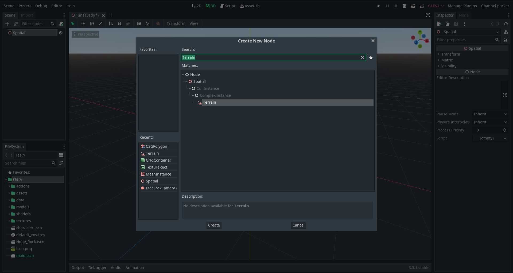

You will notice that we have a warning in the new node. What happens is that the TerrainData is a very heavy resource. It stores all the images our terrain will use and if we save it alongside the scene in a text based format, like `.tscn` or `.tres`, the parser will take a **really long** time to save it and load it. This translates into untolerable freezes and wait times.


To remove the warning, go to the ```Terrain Properties Inspector/Storage/data``` and save it to a folder. **This is very important** remember to do it every time you add a terrain node to a scene. Change the default name to something nicer.

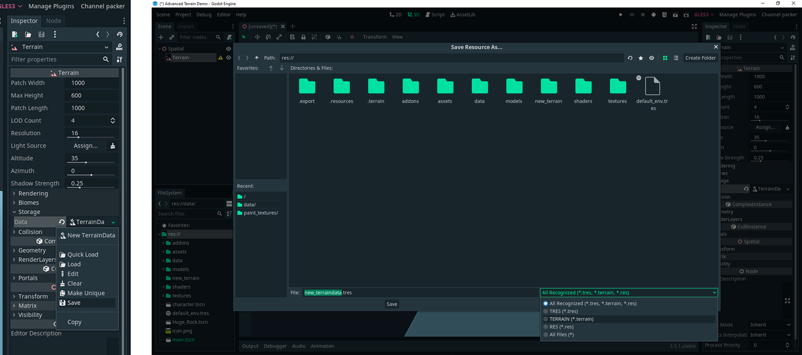

The save/import process is **SLOW** and the editor will certainly freeze, but dont panick, **wait for godot**. 

The bigger the `Terrain` the longer it will take to be saved. So, dont fear the progress bar... you will se it really often. Under the hood what is happening is that the terrain maps are being saved as common images, either `.png` or `.exr`, and being imported with a custom `ResourceImporter` that convertes them to `SmartTexture ` which is the internal `Texture` the `Terrain` uses for everything.


Once the process is complete you will se the `TerrainData` resource saved along with two new folders `patches` and `paint_textures`. Saved textures are named using the following convention `category_prefix(Index or XY Grid Coordinate)(Map Type)` 

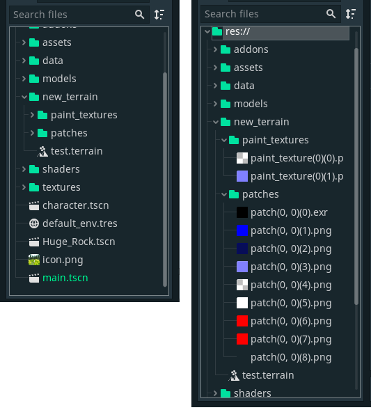

In previous version of the module `v1.0.0` and `v1.0.0-rc1` the internal resources where saved as images. If you are loading a `Terrain` from those versions, do not worry, maps will still be properly loaded, just make sure to save the `TerrainData` to a dedicated folder like we've done before here.

**Now that the `Terrain` node is ready, you can start editing it!**

**NOTE:** 
The terrain is 1000 units in size by default so you will need to change the view distance in the editor to see it and edit it properly. Go to `View/Settings/` and increase the `View Z-Far` distance.

The Terrain Inspector
--------------------

### Properties

The `Terrain` node inherits from the `ComplexInstance` class. This is a custom class created to be the base for future nodes. Think of it as kind of `VisualInstance` type of class.   


From top to bottom, the `Terrain` node has a lot of properties that can be tweaked.
* **Patch Width**: 1000 units by default
* **Max Height**: 600 units by default
* **Patch Length**: 1000 units by default

These three control the overall dimensions of every terrain patch and they can be freely modified, but preffer to keep the `width` and `length` with very similar values for better visuals.

***
* **LOD Count**: 4 by default
  
Use this toguether with 

* **Resolution**: 16 by default in GLES3 | 8 by default in GLES2
  
to control the vertex count of the terrain and the details density.

***
To control the shadows generation we have several properties:
* **Light Source**: NodePath to DirectionalLight Node in the scene
* **Altitude**: 35 by default
* **Azimuth**: 0 by default
* **Shadow Strength**: 0.25 by default

When no valid Light Source is detected `Altitude` and `Azimuth` are visible, use them to change the direction of the light.

If there is a valid LightSource detected then the light direction will be extracted from the `z axis` of the `Basis` of the `DirectionalLight`. In this case `Altitude` and `Azimuth` will be hidden.

***
The main renderers are stored in:
* **Surface Renderer**: `CDLODRenderer` by default;
* **Biome Renderer**: `GridRenderer` by default;

The `Surface Renderer` takes care of the actual rendering of the terrain. It takes in children of the `TerrainRenderer` class. Currently only one is available `CDLODRenderer` but creating others should be really easy.

The `Biome Renderer` takes care of rendering the biomes. It takes in children of the `BiomeRenderer` class. Currently only one is available `GridRenderer`. Depending on how you create and organize your biomes, this class will be your **major performance bottleneck**. Take good care of your biomes!

Each renderer has custom properties that will be detailed later

***
The `data` property under the `Storage` Group is the core of the Node and it will be explained in detail later
* **Data**: will have, always, a `TerrainData` resource assigned with at least one patch;

***

The `Collision Group` has some useful properties:
* **Carve Collider**: `deactivated` by default. Takes care of adding holes to the heightmap collider. This uses a hack when creating the `HeightMapShape` and as any hack, it may work correctly or not, but what it certainly does is that it sometimes lowers the performance of the game when colliders passes throw the hole. It can not be used along side `Use Gap Areas` under `BulletPhysicsEngine` 
* **Use Gap Areas**: `activated` by default. Creates detection areas around holes that will automatically add incoming `CollisionObjects` as exceptions allowing them to be ignored by the Terrain Collider. The same areas are responsible for unregistering the `CollisionObject` exception once the object had exited the area.. It can not be used along side `Carve Collider` under `BulletPhysicsEngine`

When `Use Gap Areas` is active, take good care of the generated shapes (visible in the editor ) because they may be a bit different than the actual visible hole and may cover areas beyond the desired gap. Create cave entrances that properly cover the generated shape. 

* **Collision Layer**: `1` by default.
* **Collision Mask**: `1` by default.

These two work by controlling the collision layers and masks like similar properties in other `CollisionObjects`.

The TerrainData
---------------

### Overview

The `TerrainData` class inherits from the `Resource` class and it is intended as the main storage for the `Terrain` node. This is the heaviest class of the module and it is the one that takes the longest time to save and load. When running your game make sure to load interactively or in separate threads the scene containing a `Terrain` node or a `TerrainData`

### Inspector Properties
#### Settings

Most of the properties in this group are intended to control internal texture sizes and texture counts.

* **Paint Mode**: `SIMPLE_4` by default. This property controls the max count of  `Paint Textures` the Terrain node can have and the TerrainData class can store, and it is used by the `CDLODRenderer` to build the internal shader. Changing its value will trigger changes in every class that depends on it. This property affects the amount of textures stored per patch.

* **Terrain Heightmap Size**: `513px` by default, controls the dimensions of the `TERRAIN_BASE_HEIGHTMAP`, `TERRAIN_HEIGHTMAP`, `TERRAIN_SHADOWS_HEIGHTMAP` and `TERRAIN_NORMALMAP`. These maps need to have the same dimensions. **`Starting from version 1.0.2 there is support for power_of_2 heightmaps`** .

> **Note**: Due to resizing issues, it is not granted that neighbor heightmaps will properly stitch toguether after rescaling, ultimately decreasing the size looks like doesn't give this error, but when upscaling, it is sure that edges will not match and the normalmaps will be broken. **Select the Textures sizes before starting to paint or edit the Terrain.** 

* **Paint Texture Size**: `512px` by default with max size `2048px`. Controls the dimensions of the paint textures. The max size is limited to `512px` when video driver is `GLES2` and `Paint Mode` is `EXTENDED_16` so that the internally generated atlas texture do not excedes `2048x2048px`

#### Patches

Here is where the actual Textures are stored. The Terrain is splited in patches with each `Patch` storing a predefined amount of textures. Each `Patch` is accessed by a key in this case the Grid Coordinate in local space with (0, 0) being The Center, (0, -1) the Top Neighbor, (-1, 0) the Left Neighbor, (0, 1) the Bottom Neighbor and (1, 0) the Right Neighbor.

The amount of textures is defined at the `terrain_enums.h` file: 
``` c
enum TerrainMap {
	TERRAIN_BASE_HEIGHTMAP,
	TERRAIN_HEIGHTMAP,
	TERRAIN_SHADOWS_HEIGHTMAP,
	TERRAIN_NORMALMAP,
	TERRAIN_GLOBALMAP,
	TERRAIN_COLORMAP,
	TERRAIN_BIOMEMAP,
	TERRAIN_WEIGHTMAP,
	TERRAIN_INDEXMAP,
	TERRAIN_MAP_MAX
};

```
##### Why this many textures?

The main objective for this module was to get a terrain that worked almost the same under `GLES3` and `GLES2` backends and in order to achieve that some sacrifices needed to be made. The first one was changing the textures formats and how the height data was stored due to the lack of `Half` and `Float` support for textures in `GLES2` powered platforms, so, instead of storing the `base_heights, processed_heights, and shadows_heights` in a single `RGBH` image, that data had to be splitted into separate images in `RGB8 format` to be used in low end devices, increasing the amount of images to be stored


* `TERRAIN_BASE_HEIGHTMAP` exists to store the deafult heights for the terrain and height data for `paths` and other separate modifications that will be mixed together in the `TERRAIN_HEIGHTMAP` which is the one that should be used in shaders
* `TERRAIN_HEIGHTMAP` is the final heightmap that should be used for every other resource in the module. It contains all the modifications made to the base heights. `heights` are stored in the `RG channels`, the `sign` in the `B channel` and the `alpha channel` is used for `holes` and `gaps`. 
* `TERRAIN_SHADOWS_HEIGHTMAP` it is used to draw distant shadows casted by the terrain and big meshes onto the surface. You can think of it as a heightmap that stores not the surface height, but the hight at which is the shadow casted down onto the surface. If an object height is below the shadow height then that object is shaded.
* `TERRAIN_NORMALMAP` contains the normalmap generated from the `TERRAIN_HEIGHTMAP`
* `TERRAIN_GLOBALMAP` it is automatically generated upon painting the terrain weightmap (splatmap for better understanding) and it is used for painting the distant patches when rendering the terrain. Aside from when the weightmap is modified, any other property that could alter the globalmap like `paint_texture resolution` will not trigger an automatic update so you should update it manually from the `Terrain Menu/Bake Globalmap` option. The `alpha channel` is used to store the postprocessed shadows casted onto the terrain after analysing the `TERRAIN_SHADOWS_HEIGHTMAP`.
* `TERRAIN_COLORMAP` contains color information. Use it to add some variation to the terrain
* `TERRAIN_BIOMEMAP` internally used to control the distribution of biomes. `R channel` contains the biome index, `G channel` contains the biome weight, `B channel` contains the exclusion areas
* `TERRAIN_WEIGHTMAP` also known as `splatmap` it stores the weights to mix several textures inside the shader
* `TERRAIN_INDEXMAP` its presense depends on the `Paint Mode` selected. It takes care of storing the Paint Texture indices when painting with `EXTENDED_16` mode.

#### Paint Textures


This section is where the textures that will be used to splatting the terrain are stored.

* **Resolution**: `1` by default, controls the tiling of the texture inside the shader
* **Use Antitiling**: `deactivated` by default, marks the texture to use some for of antitiling technique to break repetitive patterns. **Shader Performance:** Adds two texture fetches per texture using this property.
* **Use Triplanar**: `deactivated` by default, marks the texture to be used with triplanar mapping, useful for hills and cliffs. **Shader Performance:** Adds three texture fetches per texture using this property.

`Use Antitiling` and  `Use Triplanar` are mutually exclusive and activating one will deactivate the other.

* **Albedo Bump**: Expects a texture where `RGB channles` contains the ALBEDO information and the `alpha channel` the heights information. At the moment of writing, the module doesn't provide an in house method to do this but there are plenty of tool out there to combine image channels into a new file.
* **Normal Roughness**: Expects a texture where `RGB channles` contains the normal information and the `alpha channel` the roughness values.

#### Biomes

This section is available upon adding biomes from the engine editor. If the are no biomes stored it will stay hidden.

The `Biome` class is used as a storage class for `BiomeItems` which are the ones displayed by the `BiomeRenderer`. Beyond this purpose, the class doesn't do much more. Biomes are accessed using their unique index which is in the range of `0-254` so the max amount of biomes that can be stored is `255`. The major performance penalties for any game will come from rendering the biomes, so taking good care of how we configure each `BiomeItem` is mandatory.


##### BiomeItems

Each biome can have `infinite` amount of `BiomeItems` but the more the items inside every biome, the greater the performance penalty to be paid. A healthy number ranges between 5 and 8.

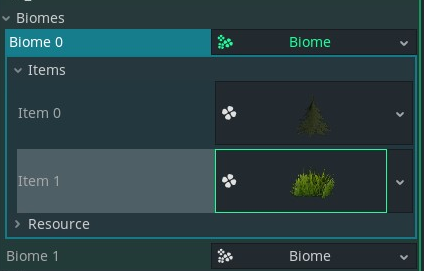

Each `BiomeItem` can be accesed from its parent `Biome` using their unique index.

This is the class with the highest count of properties. Each one of them will have an impact in how it is rendered into the scene, so take your time when configuring them.

***


Internally the `BiomeItem` class generates a default set of spawn points using a PoissonDisc Sampling technique. The generation is triggered by changing the `seed`, the `density` and the `footprint`. Of those properties the `footprint` is the one with the highest impact in how much time this set of points will take to generate, lower footprints will proportionally increase the generation time as more points will fit a given spatial unit. 


**Note**: If you are modifying any of the above properties and your editor freezes or the biomes disapears and takes a lot of time to respawn, do not dispair, **wait for godot** to complete the generation.

**Item Properties**

* **Type**: `TREE` by default. Can be any of `DECAL`, `GRASS`, `SHRUB`, `OBJECT` or `TREE` changing this will thriger a full rebuild of the `BiomeRenderer`. Each one of this types has some default settings, for example: grass will will disable any type of collision while trees and objects will enable it. Also different types will have different `Footprint` limits.
* **Distribution Type**: Defines the method used to generate the default sample of points. It can be any of:  `RANDOM`,  `JITTERED GRID` or  `POISSON` (default).
* **Seed**: Use it to control the Randomness of the default spawn points.
* **Density**: `0.5` by default. A value of `1` will generate the maximun amount possible of points for the given footprint. Lower values will proportionally lower the final set of points generated and the time of the generation process.
* **Footprint**: `4` by default. Think of it as the diameter of the item. Expressed in Godot Units. Its upper and lower limits depends on the `Type` of the item.
* **Spawn Probability**: `0.35` by default. Used at the `BiomeRenderer` to further decrease the amount of spawned items. In other terms is the probability of each spawn point of being rendered into the world.  
* **Draw Distance**: `1.0` by default. Relative max distance at which the item can be rendered. Depends on the values specified at the `BiomeRenderer`  
* **Fit Into Grid**: `active` by default but depends on the `Type` of item. Internally used at the `BiomeRenderer`. If enabled, it will check if it fits into the temporal grid where every previous item was placed. If it doesn't fit the item will not be rendered at the given spawn point.
* **Store Inside Grid**: `active` by default but depends on the `Type` of item. Internally used at the `BiomeRenderer`. The spawn point is stored inside the temporal grid so tat future items can compare its footprint or radius against it.

`Fit Into Grid` and `Store Inside Grid` are those properties that will make you Biomes look good by not placing grass or shrubs inside tree trunks.

Under the **`LODs`** section lies one key feature to gain some performance.
* **Count**: `1` by default. Use it to increase or decrease the lod group counts. The minimun value is `1` and the max value is `6`.

Each Lod group has 4 properties:
* **Mesh**: The usual mesh.
* **Distance Ratio**: `1.0` by default. Hidden and ignored on every type that accepts colliders. Used at the `BiomeRenderer` after the biome is spawned to decrease the visible count.
* **Distance Fraction**: `1.0` by default. Relative value used to calculate the max draw distance at which the `lod` will be visible withing the max `Draw Distance` range.
* **Material**: can be any of `TerrainMaterial`, `SpatialMaterial`, `ShaderMaterial`. If `Material Override` is specified under the `Geometry` group, this property will be ignored


The Placemet Rules Group affects how every instance of the item is spawned.

* **Height Min/Max/Falloff**: determine the height range in relative values at which the item can be spawned
* **Slope Min/Max/Falloff**: determine the slope range at which the item can be spawned
* **Weight Min/Max/Falloff**: determine the weight range stored in the `G channel` in the `biomemap` at which the item can be spawned. For example  use this to spawn grass in the lowest weighted region, shrubs in the mid ranges, and trees in the highest ranges.
* **X/Y/Z Rotation**: enables or diables the rotation of each item isntance along the selected axis.
* **Origin Offset**: `Vector3(0,0,0)` by default. Use it to specify a desired origin offset for the spawned item. Mostly useful for `DECAL` types of items to add some `y` offset to prevent `z fighting`.
* **Ground Alignment**: `0.0` by default. Lower values aligns the item straight up, higher values alignes the item along its up vector to the terrain normal.
  
Collision Properties depends on the type of the item.

* **Shape**: visible or ignored depending on the type of the item. The shape origin should match the mesh origin.
* **Collision Layer/Mask**: visible or ignored depending on the type of the item. Acts the same as similar properties in any `CollisionObject` class.

The Geometry Section is used to everride the item material and to specify the shadow casting method.

* **Material Override**: can be any of `TerrainMaterial`, `SpatialMaterial`, `ShaderMaterial`. If valid, any other material specified in the LODs section or inside the meshes will be ignored
* **Cast Shadow**: depends on the item type. Enable it for Trees or big objects. Disable it for grass or small objects


Main Renderers
---------------

### TerrainRenderer

The `TerrainRenderer` class is the responsible for actually rendering the terrain surface. The rendering code was extracted from the `Terrain` class into this class for better and faster prototyping, this way creating a new renderer or modifying an existing one wouldn't break non related code.

Currently only one renderer exists but adding variations of it or new ones shouldn't be difficult.

#### CDLODRenderer

The name of the renderer comes from the **`CDLOD`** algorithm used to morph between lod levels. It is fast and simple to implement. 

Internally the terrain is rendered in patches (1 patch = 1 draw call), with each patch having its predefined and prebaked quadtree which is traversed every frame to extract the visible chunks or nodes. The fact that it is prebaked gives a nice performance gain since we dont have to regenerate the entire tree every time. The rendering is directly managed using the `VisualServer` API and multimeshes.

##### Properties

The visible properties varies depending on which state the renderer is.

| **Unloked**                                                                                                    | **Locked**                                                                                                 |
| -------------------------------------------------------------------------------------------------------------- | ---------------------------------------------------------------------------------------------------------- |
| 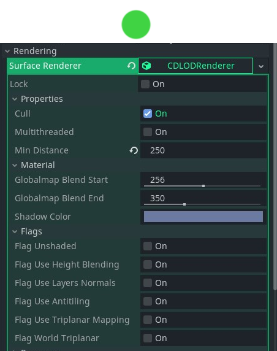 | 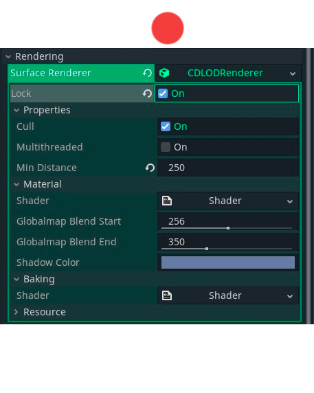 |

When **unlocked** the main difference is that the internal shader is updated automatically upon changing any of the renderer flags or in response to changes in the `Paint Mode` property from the `TerrainData` class. 

##### Common States Properties
* **Lock**: manually locks or unlocks the renderer. Use it to directly edit the shader. Mostly useful for prerelease steps, where all major changes where made to the terrain and the overall art direction was decided.
* **Cull**: activates or deactivates the frustrum culling of the internal quadtree nodes. Disabling it will incurr in chunks being drawn behing the camera, increasing vertex count and lowering performance. If enabled, make sure that the terrain has the shadow casting property disabled or else you will se wrong shadows due to patches outside the frustrum disapearing (as intended). 
* **Multithreaded**: `disabled` by default. It is used for regenerating the QuadTree. 
* **Min Distance**: `250` by default. Distance to camera at which the lowest lod (`0`) will be rendered. The value depends on the `LOD Count` and will increase automatically to the lowest aceptable value at which the LOD morphing wont break. 
* **Globalmap Blend Start/End**: these are internal shader uniforms exposed to the editor. Use them to mark where the transition to the globalmap starts and where it ends. Below `Globalmap Blend End` the Paint textures defined to splat the terrain will be read. Further than that the globalmap will be the only texture asigned to the `ALBEDO` property inside the shader. 

##### State Dependant Properties

The `Flag` properties will only be visible when the renderer in unlocked. They define the overall complexity of the shader enabling or disabling features as desired. Each flag is self explanatory. Enable or disable them to prepare the base shader.

When the renderer is locked you get acces to the main terrain `Shader` and the `Baking Shader`. Custom uniforms added to the main shader will display in the editor unless they beging with **`"u_"`** or **`"terrain_"`** (reserved prefixes).


### BiomeRenderer

#### Gridenderer


The default `BiomeRenderer` is the `GridRenderer` and the only of this type right now. It uses a tile based rendering approach where for every tile it reads the `biomemap` indentifies which biomes to consider and loops over every item starting from those of the highest type like trees and down to decals sorted by their `footprint`.

##### Properties

* **Tile Size**: `64` by default, Tile size in world units. Internally it is scaled proportionally to the terrain patch width and length
* **Max Render Distance**: `1024` by default. Maximun distance beyond which no biome item will be rendered.
* **Decal/Grass/Shrubs/Objects/Trees Distance**: Relative distances to the `Max Render Distance` beyond which no defined item type will be rendered.
* **Multithreaded**: `disabled` by default. Enable it to generate Tiles Data in separate therads. If disabled the generation task will be splitted between frames the best it can.
* **Spawn Agressiveness**: `0.4` by default. Higher values will increase the amount of items spawned per frame. 
* **Collsion Radius**: `1` by default. Radius in Tiles around the center Tile currently the camera is, that will have active collision detection. Further away tiles will have their collision disabled.

Rendering biomes can be quite slow and it highly depends on the amount of items the renderer need to check for every tile and the size of the prebaked spawn points pool. Each item needs to be checked againts previously spawned items. Once the Tile data is ready the `GridRenderer` would have created somethings like the image below where every colored circunference correspond to an item.

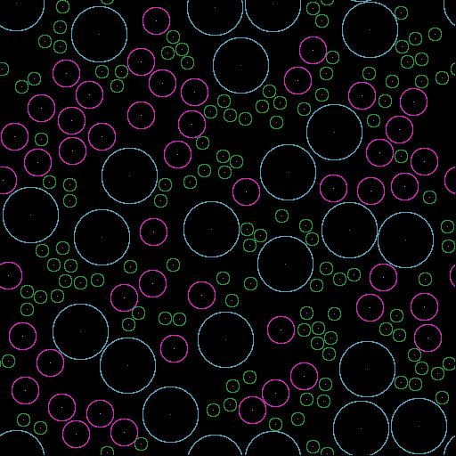

The Terrain Editor
------------------

### Overview

The terrain editor provides most of the tools you could ever need. It can be used to create the entire terrain shape without leaving Godot but gives enough flexibility in the case that you prefer generating the data in a thirdparty software for later loading it to the engine.

### Starting with the TerrainMenu


The `Terrain Menu` is the tiny terrain pinkish icon at the top left of the side bar in your spatial editor view. When pressed several options popups. From top to bottom:

* **Bake Terrain Globalmap**: This will bake your terrain globalmap. use this after freshly added the terrain to the scene or before saving the scene. also, remember to press it after changing paint textures maps, or properties.  
* **Bake Biomes exclusion Maps**: This will bake the exclusion regions to the `biomemap`. These are the areas where no biome will be rendered. It will bake three things: `BiomeBlockers`, `SurfaceEditors` with the block biomes properties enabled, and the gaps painted into the `heightmap`. 
* **Bake Heightmap Shadows**: A REALLY REALLY SLOW process. This will trigger four different actions: 1) Bake the `MeshInstances` under `SurfaceEditors` with the `Use in Terrain Shadows` property enabled, 2) Temporarily copy the generated heightmap data into a vector of floats, 3) Generate the actual shadows heightmap and finally 4) Regenerate the globalmaps since we need to update the alpha channel with the newly generated shadows. Be patient and dont freak out. The bigger the `Terrain` the longest the time it will take to complete its job. **Wait for Godot** at all times :P 
* **Regenerate Biomes**: If something doesn't goes well with your biomes, hit this option to trigger a full reset/regeneration. If something wrong happens [**open an issue at github**](https://github.com/ozzr/godot_terrain) to let me know.
* **Regenerate Terrain Collision Data**: Make sure to press it at least once before saving the scene or exporting your game. This will make sure that the heightmap collision data and gap shapes are properly generated. Not doing this will strive in wrong collision error.
* **Create Navigation Mesh**: This will add a NavigationMeshInstance child with a `NavigationMesh` created from the combined patches of the terrain as to ensure patch continuity
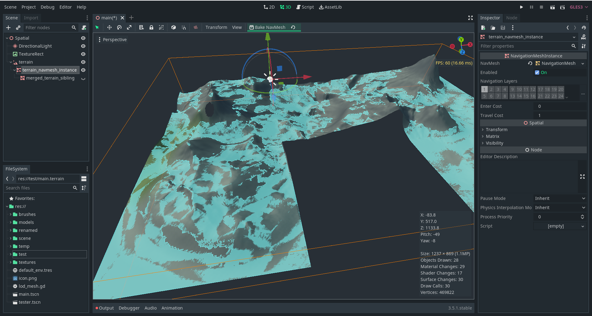
> **IMPORTANT**: Currently no biome mesh is taken into account when generating the `NavigationMesh`. 

> **NOTE:** The generated **`MeshInstance`** (hidden by default ) is a decimated geometry of the terrain and it is the source for the NavigationMesh. The simplification strength is selected after pressing the `Create Navigation Mesh` option. If you dont have any use for this mesh, **REMOVE IT**

> **WARNING**: Baking a NavigationMesh with this **HUGE** mesh might crush the editor. Experiment changing some `NavigationMesh`  parameters until you get something that works for you  

* **Create Mesh From Terrain**: Exports each patch of the Terrain as a separate `MeshInstance` decimated as stated in a pregeneration process.
  

  > **IMPORTANT**: The generation depends on the current Terrain resolution value. 

  > **NOTE**: Normals Smoothing can be activated in a pregeneration step along with the decimation value. 
* **Inport External Data**: A juicy option to import externally generated maps.
#### How to import External Textures

Mandatory requirements for this feature to work properly:

* Import only three types of textures: `heightmaps`, `normalmaps`, and `splatmaps`. Any other type of map will be generated internally either baking the shadows heightmap or the globalmap.
* Textures to be imported need to be named using the following convention: **`[any name]_[grid coordinate]_[map_type].[file_extension]`** where **`[grid coordinate]`** is the **`x`** and **`y`** grid key placed inside parentesis **`()`** separated by **`,`** ; and **`[map_type]`** is either one of the following suffixes:

| **Map Type** | **Valid Suffixes**                                  | **Notes**                                                                                                                                                                                                        |
| ------------ | --------------------------------------------------- | ---------------------------------------------------------------------------------------------------------------------------------------------------------------------------------------------------------------- |
| `Heightmap`  | `heightmap`, `hmp`                                  | Upon loading only the `Red channel` will be considered to generate the internal heightmap. Make sure that the source texture has at least 16 bit of depth. This texture will be the new `TERRAIN_BASE_HEIGHTMAP` |
| `Normalmap`  | `normalmap`, `nmp`, `normp`                         | This map is not so necesary since it can be generated internally                                                                                                                                                 |
| `Splatmap`   | `splatmap`,`wightmap`, `wmp`,`wmap`, `spmp` , `smp` | Only one splatmap can be loaded. If you need more maps let me know in  [**the github repo**](https://github.com/ozzr/godot_terrain) so I am aware of other use cases.                                            |

* **Examples**: **`my_heightmap_(0, 0)_hmp.exr`,`my_heightmap_(0, -1)_heightmap.exr`, `my_normalmap_(0, 0)_normalmap.png`, `my_splatmap_(0, 1)_smp.jpg`**.

If the above requirements are met proceed to press the `Import External Data` option from the `Terrain Menu`. A new popup window will appear. Copy the filesystem directory where your textures are stored. Selected the images to import and hit `Open`.

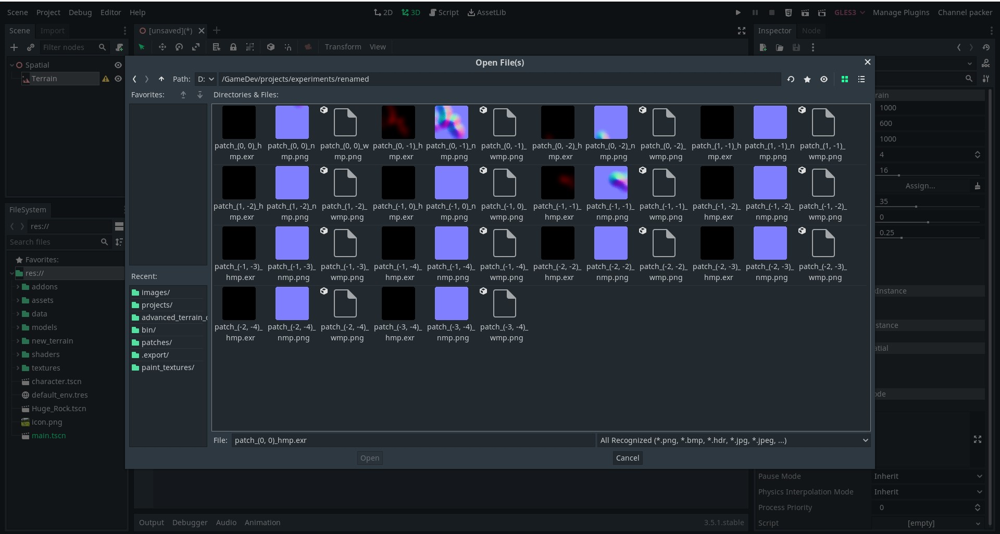

Let Godot do its job...

Once everything was processed you should get a nice terrain like the one below. Hit `Bake Heightmap Shadows`,save the `TerrainData`,  and everything is ready.

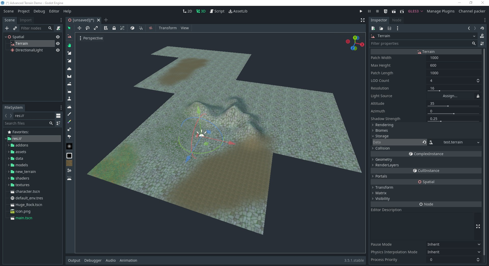

### A lot of Tools

We are already done with the `Terrain Menu` now it is time to switch to another set of tools. Hovering the Tool Button will display its hint text. Use it to remember what the button does.


**From top to bottom:**
* **Modify Terrain Transform**: press it to modify the node origin.
* **Add New Terrain Patch**: Add new patches at any of the free cells displayed along side the existing patches.
* **Remove Selected Terrain Patch**: Removes the selected terrain patch.
* **Raise Height**: Add heights to the terrain using the selected brush.
* **Lower Height**: Remove heights from the terrain using the selected brush.
* **Smooth Height**: Slowly smoothes the surface of the terrain averaging the height values using the selected brush.
* **Flatten Height**: Slowly flattens the surface of the terrain to the defined height value using the selected brush. The target height will be extracted from the `brush opacity` property. For this case `0.5` represents the sea level, `0.0` the lowest negative height and `1.0` the max possible height.
* **Stamp Height**: Stamp a brush mask directly to the terrain surface. The `brush opacity` behaves the same as in the **`Flatten Height`** option. controlling the strength of the brush effect. in this case a value of `0.5` will make the stamp mask to have no effect, `0.0` will lower the terrain and `1.0` will raise it. 
* **Path paint**: Sets the editor to add paths to the terrain surface. Paths can be mainly of two type: `Roads like paths` that rise the terrain, or River like paths which lower the surface height. Upon seleting this tool, the `editor brush` will adapt to it.
* **Erode Height**: Erodes the terrain surface using the selected brush mask and the erosion method selected in the `Erosion & Filters Editor`. 
* **Texture Paint**: Paints the surface splatmaps and idmaps depending on the `Paint Mode` specified at the TerrainData. It uses the brush selected in the `Brush Editor` and the active `PaintTexture` at the `Paint Textures Editor`. 
* **Color Paint**: Paints the surface colormap with the selected brush and the active `color` from the `Brush Color Editor`. 
* **Terrain Holes**: Add holes to the terrain using the selected brush. 
* **Biome Paint**: Use it to add biomes to the world using the selected brush and the selected biome at the `Biome Manager`. 

### Dedicated Editors

***
#### Brush Editor


By default the `Brush Editor` will display `9` masks. You can load custom ones from your project folder. Those new brushes will be stored at the `.terrain/brushes/` folder.

##### Brush Properties

* **Size**: Relative size to the Terrain Patch width and length
* **Opacity**: in the range from 0 to 1. How it is used depends on the active Tool Button
* **Slope Min**: Property used to apply several effects based on the surface slope when painting. Its usage depends on the active Tool Button.
* **Slope Max**: Property used to apply several effects based on the surface slope when painting. Its usage depends on the active Tool Button.
* **Preserve Paths**: When editing the terrain, if this property is checked, the editor will preserve the path data stored in the green channel of the `TERRAIN_BASE_HEIGHTMAP` texture, else it will destroy it.
 
***
#### Paint Textures Editor


This editor exposes every paint texture property. Use it to add, update or remove `paint textures` to or from the `TerrainData`.

Like with the `Brush Editor` pressing the add button will display a new window to load new textures. 

Many pairs of textures can be loaded at once. By default the editor will search for the suffixes mentioned below. If no valid suffix is found, the texture will be marked as `Albedo Bump` and imported like one. Images will paired using the filename characters minus the suffix characters and the file extension.

For example: **`cliff_01_abb.png`** and **`cliff_01_nmr.png`** will be paired

| **Map Type**       | **Valid Suffixes**                 |
| ------------------ | ---------------------------------- |
| `Albedo Bump`      | `albedo_bump`, `abb`               |
| `Normal Roughness` | `normal_roughness`, `normr`, `nmr` |

##### Editor Properties


See **[Paint Textures](#paint-textures)** for the detailed explanation.

***
#### Biome Manager


Its sole purpose is to add or remove biomes and items to the `TerrainData`. Each `BiomeItem` property should be modified at the `TerrainData`

The reason to not add all those properties to this editor is precisely the huge amount of them.
\
\
\
\
\
**Note**: Any advice or request for this editor is well received.

***
#### Erosion & Filters Editor

Below are the `3` currently implemented `erosion simulators` and `1` image `filter`. After creating the aproximate shape of the terrain, using these simulators allow to give a more natural feeling to the `terrain`. These process are implemented in the CPU... and ence are slow. Under the hood they all use multithreading to ease the job but they have computational expensive calculations that takes time. 

Prefer to use these simulators with a fully white brush mask so you dont loose too much detail when applying the modified height data into the heightmap.


***
#### Path Painter

The Path Painter is intended to be used to modify the path to be painted properties. It has two basic modes: 
1. **Paint Road Like Paths** 
2. **Paint River Like Paths**

The main difference between modes is that paths exported in the river mode will have its height right at the origial curve height, unlike road paths where the height id offsetted by the `Height Offset` property
> HINT: Each path will  store the blend value used to mix the path height with the terrain height in the green channel of the TERRAIN_BASE_HEIGHTMAP texture
> 
##### Properties
* **Export Path**: Will generate a TerrainPath Node from the generated curve. Instanced as a child of the current terrain being edited
* **Width**: This determines the main width of the path. Useful for roads, but less important for rivers where the blend distance would have better results
* **Blend Distance**: This is the distance along which the terrain height will blend with the path height.
* **Height Offsete**: Used to control the height at which the path center should be carved. This can be possitve or negative for roads, but can only have negative values for rivers.
* **Max Slope**: To control the maximun degree of freedom tolerated by the path in the y axis when painting.
* **Min Step Size**: Minimum distance between control points in the path.
* **Blending Curve**: Used to blend between the terrain height and the path height. By default will display as a smoothstep interpolation.
* **Tessellation Properties**: To control the curve points density when painting.

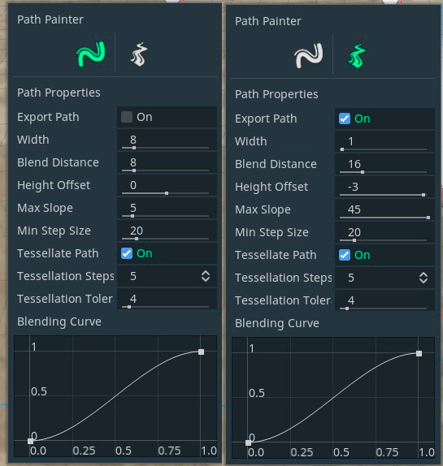


TerrainPath
------------------

### The Node
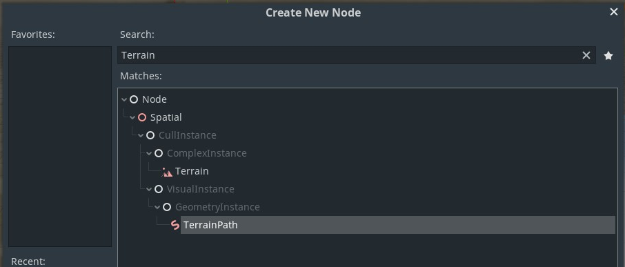

The `TerrainPath` class inherits from the `GeometryInstance` class and it is intended to be used directly for creating and modifying the the internal mesh from the suplied `Curve3D`.

By default the newly instanced `TerrainPath` class will have its geometry setted to `NONE` but there are thre different shapes to be chosed from: `PLANE`, `BOX`, `CYLINDER`. **Planes** are better suited for **Rivers** while Boxes are better for roads. **Cylinders**... they are useful.

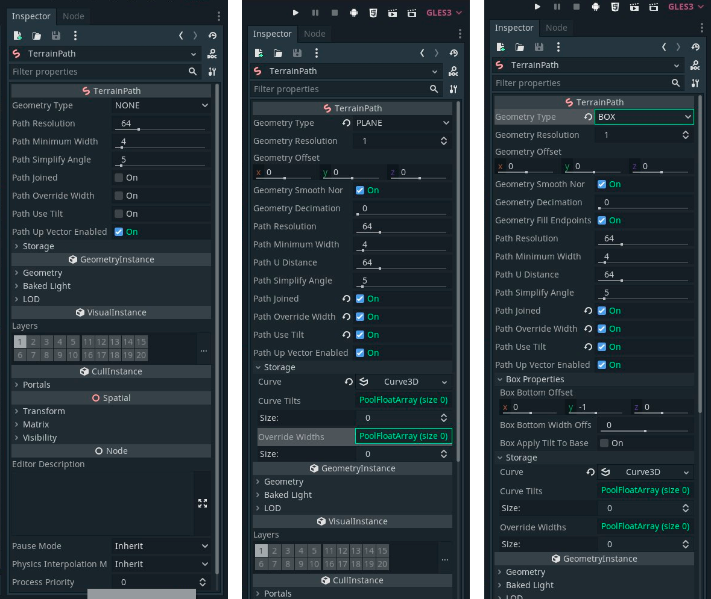

Properties prefixed with `geometry` will affect the generated 
mesh only, while those prefixed with `path` will work on the Curve3D and the internally generated path.

> **HINT:** Paths baked by the TerrainPath are different than those obtained from Curve3D.get_baked_points

Additionally other groups of properties might be visible depending on the geometry type selected.

> **HINT:** in shader the COLOR.a goes from 0 to 1 and describes the length of the path
> 
> **HINT:** When using a Plane shape, the COLOR.rgb channels store the direction from the current vertex to the next center vertex of the path

### The TerrainPath Editor and Gizmos

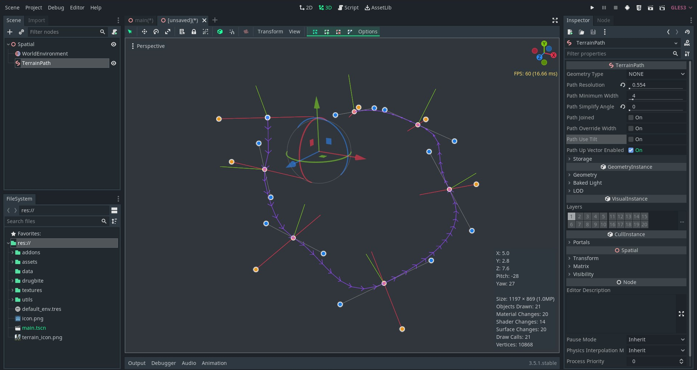

The Editor is based on the original PathEditorPlugin implementation from the engine but extended with new features and tweaked for better usability. As you can see above, there are new gizmos attatched for better management of the Curve3D data.

`Orange handles` are in charge of controlling the width of the path. With values can be previewed also in the Node inspector. Visually, the with at a given control point can be previewed b looking at the red lines that crosses the position handles. `Green handles` are in charge of modifying the tilt. If the tilt is set to be used a circle will appear around the control points with the tilt handle at the end of the green line (normal direction) `(see image below)`
 
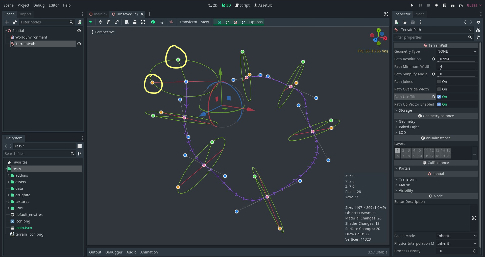

#### Editor Menu
The editor menu offers the same options as those available when editing a Path node, but since we are working with TerrainPath nodes now there are other properties to play with.

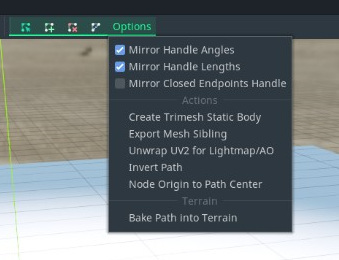

* **Mirror Closed Endpoints**: Will treat endpoint control handles as one when both path endpoints matches 
* **Create Trimesh Static Body**: Will generate a collision body for the path geometry if a valid internal mesh exists.
* **Export Mesh Sibling**: Will generate a MeshInstance node with the internal mesh.
* **Unwrap UV2**: Will prepare the mesh for lightmap usage.
* **Invert Path**: Inverts the direction of the path by inverting the order of the points in the base Curve3D.
* **Node Origin to Center**: Changes the control point coordinates and centers the TerrainPath Node transform to the center of the path.
* **Bake Path into Terrain**: Popups a second windows with properties similar to those in the  `PathPainter`  (see below image), searches for every Terrain node available in the escene and bakes the path into the surface.
  
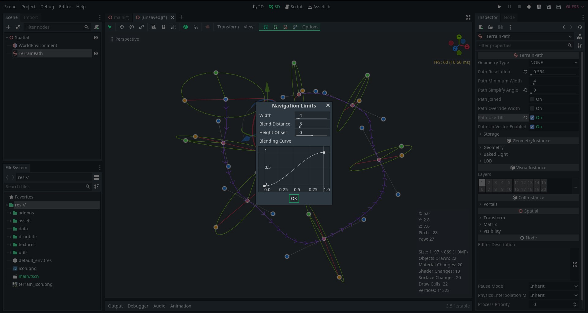
